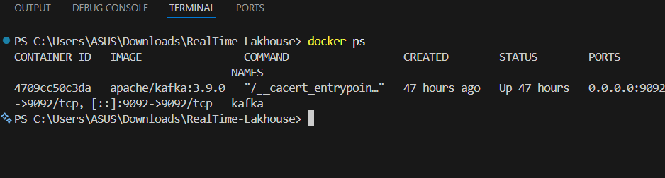
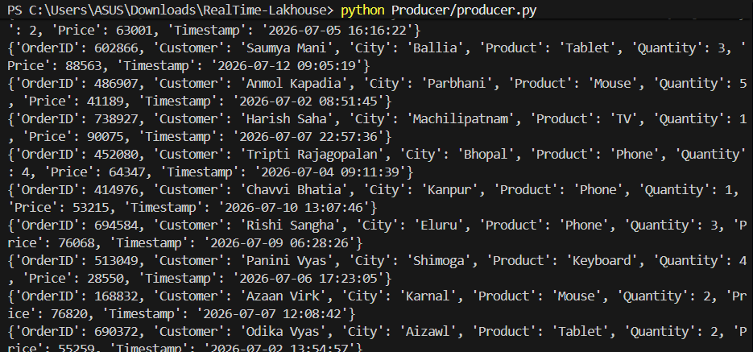
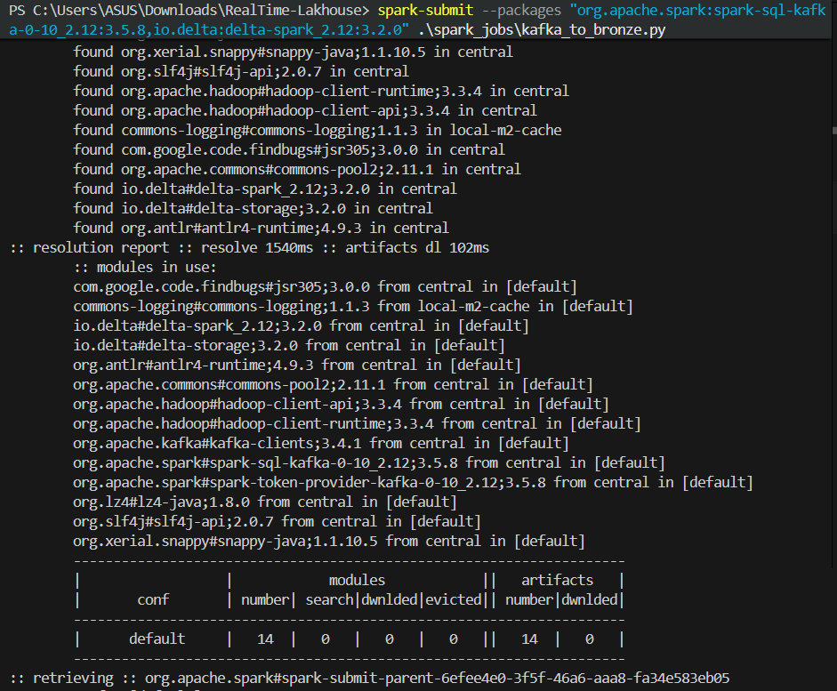
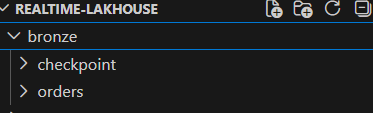
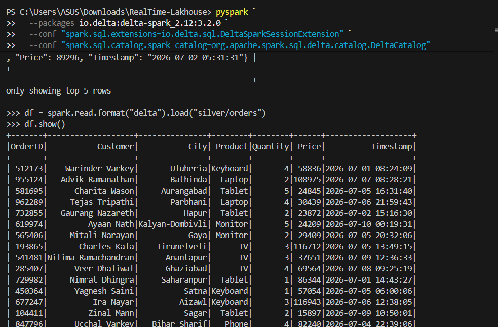
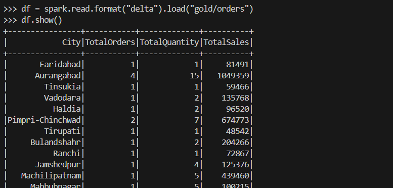
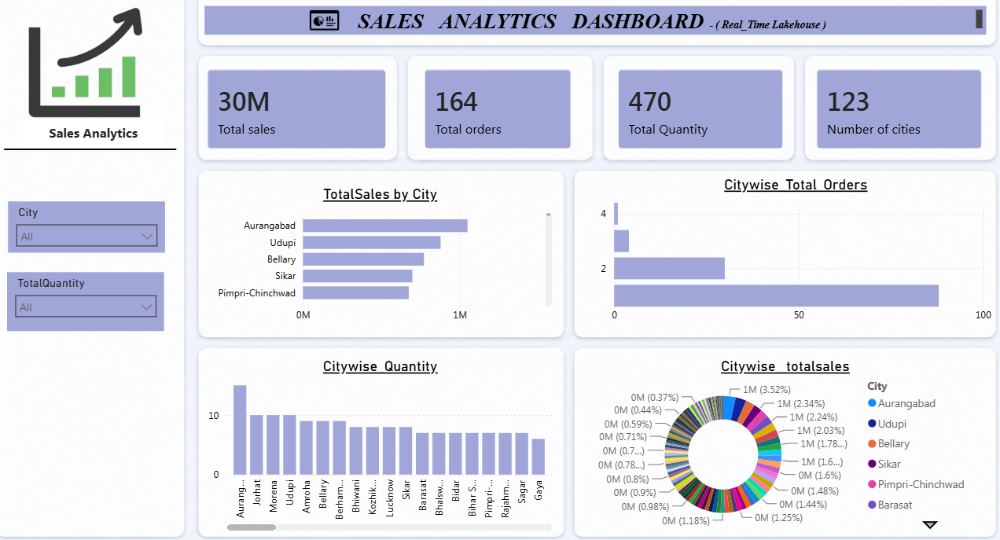

# Real-Time Sales Lakehouse

[](https://www.python.org/)
[](https://kafka.apache.org/)
[](https://spark.apache.org/)
[](https://delta.io/)
[](https://powerbi.microsoft.com/)

An end-to-end real-time sales analytics project that generates sales events, streams them through Apache Kafka, processes them with PySpark Structured Streaming, and stores them in Bronze, Silver, and Gold Delta Lake layers using the Medallion Architecture.

The curated Gold-layer data is designed for business reporting and Power BI visualization.

---

## Project Objective

The objective of this project is to demonstrate how a real-time data engineering pipeline can:

- Generate continuously changing sales transactions.
- Ingest events through Apache Kafka.
- Process streaming data with PySpark Structured Streaming.
- Store reliable and versioned data in Delta Lake.
- Apply Bronze, Silver, and Gold Medallion Architecture.
- Produce city-level business KPIs.
- Support reporting through Power BI.

---

## Architecture

```mermaid
flowchart LR
    A[Python Sales Producer<br/>Faker + kafka-python]
    B[Apache Kafka<br/>sales topic]
    C[PySpark Structured Streaming<br/>Kafka ingestion]
    D[(Bronze Delta Layer<br/>Raw JSON events)]
    E[PySpark Cleaning<br/>Parse, deduplicate, remove nulls]
    F[(Silver Delta Layer<br/>Clean sales records)]
    G[PySpark Aggregation<br/>City-level KPIs]
    H[(Gold Delta Layer<br/>Total Orders, Quantity and Sales)]
    I[Power BI Dashboard<br/>KPIs and city analysis]

    A -->|JSON sales event| B
    B -->|Streaming read| C
    C --> D
    D --> E
    E --> F
    F --> G
    G --> H
    H --> I
```



### End-to-End Data Flow

1. `Producer/producer.py` creates a new sales event every second.
2. The producer publishes each event to the Kafka topic named `sales`.
3. `spark_jobs/kafka_to_bronze.py` consumes Kafka messages as a stream.
4. Raw Kafka message values are stored in the Bronze layer as Delta data.
5. `spark_jobs/bronze_to_silver.py` parses the JSON, removes duplicates and null records, and converts the timestamp.
6. Cleaned records are written to the Silver Delta layer.
7. `spark_jobs/silver_to_gold.py` calculates city-level aggregations.
8. Gold data is used for Power BI reporting.

---

## Medallion Architecture

### Bronze Layer

The Bronze layer stores raw Kafka message values without changing the original event content.

**Location**

```text
bronze/orders
```

**Purpose**

- Preserve raw streaming data.
- Support replay and troubleshooting.
- Maintain Delta transaction logs.
- Provide the source for Silver processing.

### Silver Layer

The Silver layer contains structured and cleaned sales records.

**Transformations**

- Parse raw JSON events.
- Apply the expected schema.
- Remove duplicate records.
- Remove rows containing null values.
- Convert the timestamp column to a Spark timestamp.

**Location**

```text
silver/orders
```

### Gold Layer

The Gold layer contains business-ready city-level aggregates.

**Metrics**

- Total Orders
- Total Quantity
- Total Sales

**Location**

```text
gold/orders
```

**Aggregation logic**

```python
gold = (
    silver
    .groupBy("City")
    .agg(
        count("OrderID").alias("TotalOrders"),
        sum("Quantity").alias("TotalQuantity"),
        sum(expr("Quantity * Price")).alias("TotalSales")
    )
)
```

---

## Technologies Used

| Technology | Purpose |
|---|---|
| Python | Sales-event generation |
| Faker | Creation of realistic customer and city values |
| kafka-python | Publishing events to Kafka |
| Apache Kafka | Real-time event streaming |
| Docker | Running Kafka locally |
| PySpark | Streaming transformation and aggregation |
| Spark Structured Streaming | Continuous processing |
| Delta Lake | ACID storage and transaction history |
| Power BI | KPI reporting and visualization |
| Git and GitHub | Version control and project sharing |

---

## Project Structure

```text
Realtime-Lakehouse/
│
├── Producer/
│   └── producer.py
│
├── docker/
│   └── docker-compose.yml
│
├── spark_jobs/
│   ├── kafka_to_bronze.py
│   ├── bronze_to_silver.py
│   └── silver_to_gold.py
│
├── bronze/
│   ├── orders/
│   └── checkpoint/
│
├── silver/
│   ├── orders/
│   └── checkpoint/
│
├── gold/
│   ├── orders/
│   └── checkpoint/
│
├── delta/
├── powerBi/
├── Screenshots/
├── .gitignore
├── requirements.txt
└── README.md
```

> Delta data folders, checkpoint folders, and generated files may appear only after the streaming jobs have started.

---

## Sales Event Schema

The producer creates events similar to the following:

```json
{
  "OrderID": 584231,
  "Customer": "Aarav Sharma",
  "City": "Pune",
  "Product": "Laptop",
  "Quantity": 2,
  "Price": 65000,
  "Timestamp": "2026-07-12 10:25:30"
}
```

| Column | Data Type | Description |
|---|---|---|
| OrderID | Integer | Unique sales order identifier |
| Customer | String | Generated customer name |
| City | String | Customer city |
| Product | String | Product purchased |
| Quantity | Integer | Number of units |
| Price | Integer | Price per unit |
| Timestamp | Timestamp | Time at which the event was generated |

The producer currently selects products from Laptop, Phone, Monitor, TV, Keyboard, Mouse, and Tablet.

---

## Prerequisites

Install the following software before running the project:

- Python 3.11
- Java Development Kit
- Apache Spark 3.5.8
- Docker Desktop
- Git
- Power BI Desktop, for dashboard development

Verify the installations:

```bash
python --version
java -version
spark-submit --version
docker --version
git --version
```

---

## Installation

### 1. Clone the repository

```bash
git clone https://github.com/vedantirohankar/Realtime-Lakehouse.git
cd Realtime-Lakehouse
```

### 2. Create a virtual environment

For Git Bash on Windows:

```bash
python -m venv .venv
source .venv/Scripts/activate
```

### 3. Install Python dependencies

```bash
pip install -r requirements.txt
```

The main dependencies are:

```text
kafka-python
faker
pandas
delta-spark==3.2.0
pyspark==3.5.8
```

---

## How to Run the Pipeline

The applications are continuous streaming processes. Open separate Git Bash or terminal windows for the commands below.

### Step 1: Start Kafka with Docker

```bash
cd docker
docker compose up -d
docker ps
cd ..
```

Confirm that the Kafka container is running and that port `9092` is exposed.

### Step 2: Start Kafka-to-Bronze Streaming

```bash
spark-submit \
  --packages org.apache.spark:spark-sql-kafka-0-10_2.12:3.5.8 \
  spark_jobs/kafka_to_bronze.py
```

This job:

- Connects to Kafka at `localhost:9092`.
- Subscribes to the `sales` topic.
- Reads Kafka values as strings.
- Writes raw JSON messages to `bronze/orders`.
- Stores streaming progress in `bronze/checkpoint`.

### Step 3: Start Bronze-to-Silver Streaming

Open another terminal from the project root:

```bash
spark-submit spark_jobs/bronze_to_silver.py
```

This job parses and cleans Bronze events before writing them to `silver/orders`.

### Step 4: Start Silver-to-Gold Streaming

Open another terminal from the project root:

```bash
spark-submit spark_jobs/silver_to_gold.py
```

This job continuously calculates city-level KPIs and writes them to `gold/orders`.

### Step 5: Start the Python Producer

Open another terminal:

```bash
python Producer/producer.py
```

The producer publishes one sales event per second to Kafka.

---

## Recommended Startup Order

```text
1. Docker Kafka
2. Kafka-to-Bronze Spark job
3. Bronze-to-Silver Spark job
4. Silver-to-Gold Spark job
5. Python producer
```

Use `Ctrl + C` in each terminal to stop a streaming application.

Stop Kafka when testing is complete:

```bash
cd docker
docker compose down
```

---

## Power BI Dashboard

The Gold layer is designed to support a sales dashboard with the following components.

### KPI Cards

- Total Sales
- Total Orders
- Total Quantity
- Number of Cities

### Recommended Visuals

- Sales by City — Bar Chart
- Orders by City — Column Chart
- Quantity by City — Column Chart
- Sales Share by City — Donut Chart
- City Filter
- Product Filter
- Date Filter

For a local Power BI demo, Gold Delta data can be exported to CSV or Parquet before importing it into Power BI Desktop. In a cloud implementation, the Delta tables can be exposed through a Lakehouse, Databricks SQL, or another supported query endpoint.

---

## Screenshots to Add

Create a folder named `Screenshots` and add the following screenshots. Use the exact filenames so the images render correctly in this README.

### 1. Kafka Container Running

**Filename**

```text
Screenshots/01_docker_kafka_running.png
```

**Capture**

- Docker Desktop or the output of `docker ps`.
- Kafka container status must show `Up`.
- Port mapping should show `9092`.



### 2. Real-Time Producer Output

**Filename**

```text
Screenshots/02_producer_events.png
```

**Capture**

- Git Bash or VS Code terminal running `python Producer/producer.py`.
- Show several generated sales dictionaries.
- Include OrderID, Customer, City, Product, Quantity, Price, and Timestamp.



### 3. Kafka-to-Bronze Spark Job

**Filename**

```text
Screenshots/03_kafka_to_bronze_job.png
```

**Capture**

- Terminal running the Kafka-to-Bronze Spark job.
- Show that the Spark application started successfully.
- Avoid capturing unrelated warnings or personal file paths where possible.



### 4. Bronze Delta Files

**Filename**

```text
Screenshots/04_bronze_delta_files.png
```

**Capture**

- VS Code Explorer showing `bronze/orders`.
- Include the `_delta_log` directory and Delta part files.
- This proves that raw Kafka events were persisted.



### 5. Clean Silver Data

**Filename**

```text
Screenshots/05_silver_clean_data.png
```

**Capture**

- A Spark `show()` output or notebook result for `silver/orders`.
- Show the structured columns and several cleaned rows.
- Ensure Timestamp is displayed as a timestamp.



### 6. Gold Aggregated Data

**Filename**

```text
Screenshots/06_gold_city_aggregation.png
```

**Capture**

- A Spark `show()` output or notebook result for `gold/orders`.
- Show City, TotalOrders, TotalQuantity, and TotalSales.



### 7. Power BI Dashboard

**Filename**

```text
Screenshots/07_powerbi_dashboard.png
```

**Capture**

- The complete dashboard page.
- KPI cards should be readable.
- Include city-level charts and slicers.
- Crop out the Windows taskbar and unrelated applications.



### Optional: Project Folder Structure

**Filename**

```text
Screenshots/08_project_structure.png
```

**Capture**

- VS Code Explorer showing the main project folders and files.
- Do not include secrets, tokens, or environment-variable files.


---

## Screenshot Quality Guidelines

- Use PNG format for clear text.
- Keep the screenshots between approximately 1200 and 1800 pixels wide.
- Crop empty space and unrelated windows.
- Do not expose passwords, tokens, email addresses, or private connection strings.
- Keep one screenshot focused on one pipeline stage.
- Prefer terminal output that proves the job is running successfully.
- Do not use screenshots of code when the same code is already available in the repository.

---

## Business Outcomes

This pipeline demonstrates the ability to:

- Build a real-time event-driven data pipeline.
- Process unbounded data with Structured Streaming.
- Implement Delta Lake with ACID transaction support.
- Organize data through Medallion Architecture.
- Apply data-quality transformations.
- Build reusable business aggregates.
- Deliver Power BI-ready analytics data.

---

## Future Enhancements

- Add schema validation and invalid-record quarantine.
- Add unit tests for transformation logic.
- Add Kafka topic creation automation.
- Add product-level and date-level Gold tables.
- Add average order value and top-selling product metrics.
- Add watermarking for late-arriving events.
- Use cloud object storage instead of local folders.
- Deploy Spark processing to Azure Databricks or Microsoft Fabric.
- Add CI/CD through GitHub Actions.
- Add data-quality monitoring and alerting.

---

## Author

**Vedanti Rohankar**

- GitHub: [vedantirohankar](https://github.com/vedantirohankar)
- Project: [Realtime-Lakehouse](https://github.com/vedantirohankar/Realtime-Lakehouse)

---

## License

This project is intended for learning, portfolio demonstration, and educational use.
